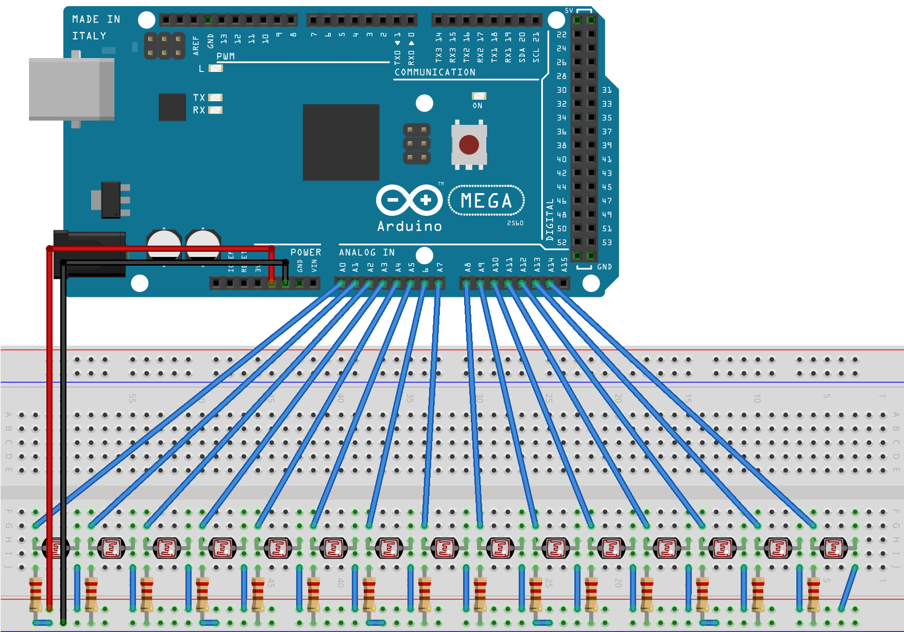

## 01 Egg Step Sequencer
[pattvira.com/egg-step-sequencer](http://pattvira.com/egg-step-sequencer)

### What you need

**Hardware + Tools:**

- 15 Eggs 
- [15 Egg holders](http://www.ikea.com/us/en/catalog/products/00190689/) 
- [Arduino MEGA](https://www.arduino.cc/en/Main/ArduinoBoardMega2560)
- [15 Light sensors](https://www.amazon.com/SUNKEE-Sensitive-Resistor-Photoresistor-Optoresistor/dp/B00AQVYWA2)
- 15 10K Resistors
- Jumper wires / Wires / Header pins
- Breadboard
- Soldering Iron / Solder

**Software:**

- [Arduino IDE](https://www.arduino.cc/en/Main/Software)
- [Max MSP](https://cycling74.com/products/max/) (There is a 30-day free trial version)

**Code:**

- Arduino: egg_step_sequencer.ino
- Max MSP: sequencer.maxpat & saw_note.maxpat

**Circuit:**

**Steps:**

**Arduino Side**

1. Wire up the circuit, following the circuit diagram above.
2. Load the Arduino code to the Arduino Mega. Open the serial terminal to make sure that 15 values are being printed every 1/10th of a second.

**Max MSP Side**

1. Make sure that the sequencer.maxpat and saw_note.maxpat are inside the same folder.
2. Open sequencer.maxpat.
3. Change the metro interval number from 0 to something higher (I recommend somewhere between 125-250). This is the interval (in millisecond) of which the beat moves.
4. Calibrate the sensors by turning on Toggle Button # 2 and put an egg on each sensor. You should see the value goes to 0 when there is an egg, and 255 when there is not. 
5. Turn Toggle Button # 1 and the speaker on, and have fun!

**Useful Links:** 

- [Max MSP Step Sequencer video tutorial](https://www.youtube.com/watch?v=hYc2a1ONTck)
- [Adafruit's write up on photocell aka light sensor](https://learn.adafruit.com/photocells/using-a-photocell)

